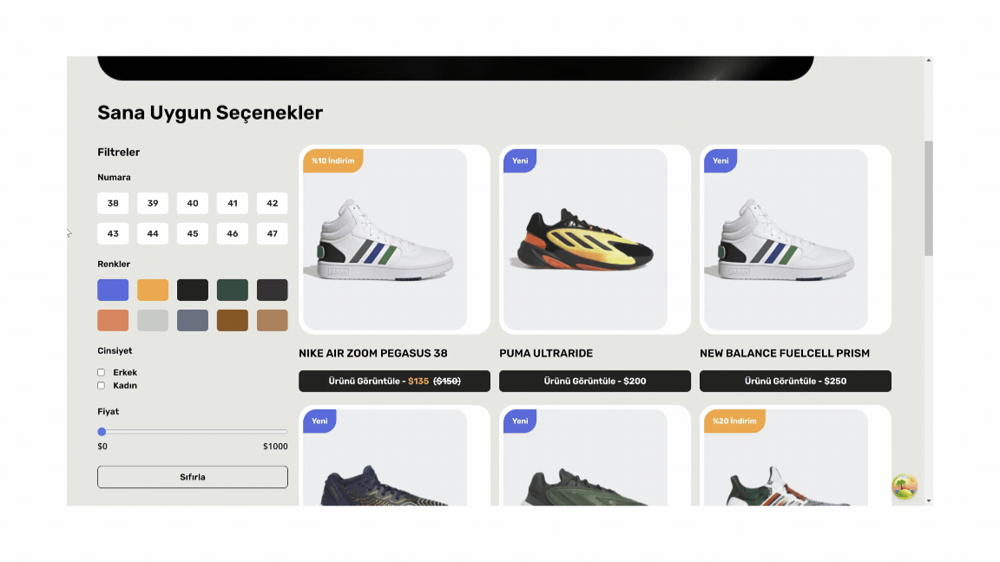

# Teknolojiler

- react
- typescript

# Kütüphaneler

- react-router-dom
- tailwind
- axios
- json-server
- @tanstack/react-query
- react-toastify

# Uygulanan Tasarım

- https://www.figma.com/community/file/1214498651988846999/kicks-shoes-ecommerce-website-and-admin-mvp

# Özellikler

- Ürün Listesi: Kullanıcıların çeşitli ayakkabıları keşfedebileceği ve ürün kartlarıyla detaylara ulaşabileceği bir listeleme sayfası oluşturdum.
- Card Bileşeni: Ürün bilgilerini ve indirimleri gösteren, kullanıcı dostu ve şık bir kart tasarımı geliştirdim. Her kartta ürünün adı, resmi, fiyatı ve indirim bilgileri yer alıyor.
- Filtre Bileşeni: Kullanıcıların ürünleri renk, beden, cinsiyet ve fiyat aralığı gibi kriterlere göre filtrelemelerini sağlamak için kapsamlı bir filtreleme sistemi geliştirdim.
- Detay Bileşeni: Ürün hakkında detaylı bilgi, renk ve beden seçenekleri, fiyat ve indirim bilgileri ile kullanıcıların bilgilendirilmesini sağladım. Ayrıca, ürün açıklamaları ve görselleri de bu sayfada yer alıyor.

# GIF

